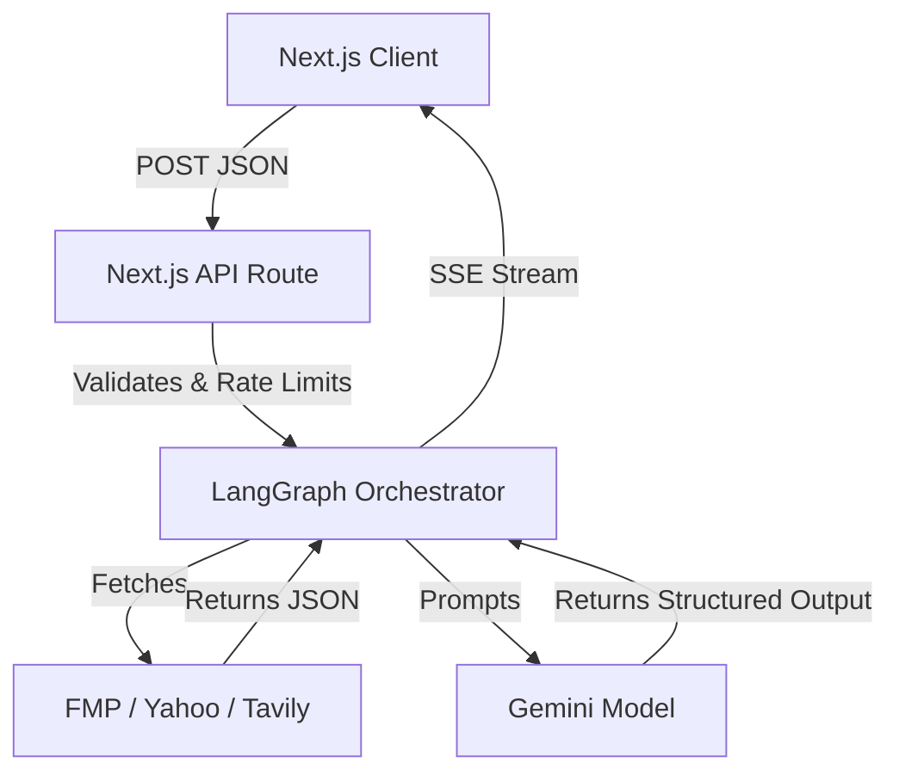
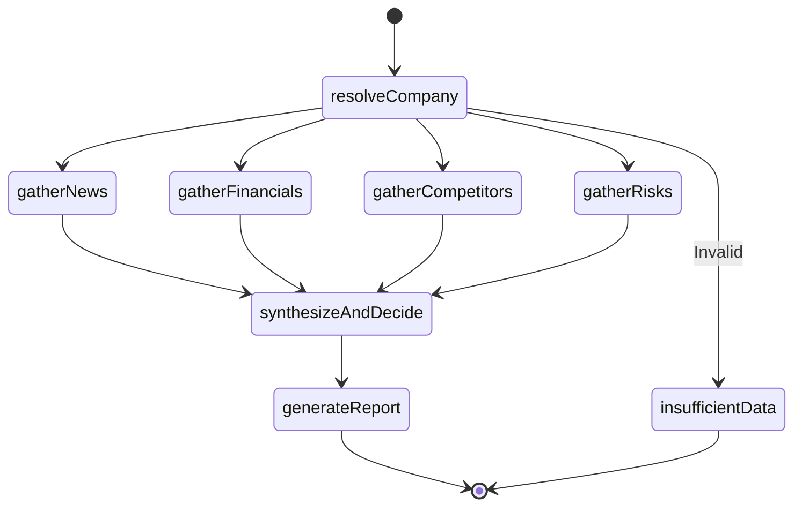
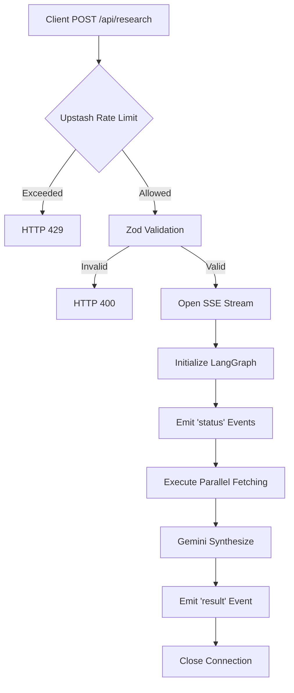

# API Reference

VestPulse exposes a robust, server-side API for autonomous AI-powered investment research. The API orchestrates a LangGraph state machine, interacting with various financial and news providers, and utilizes Google Gemini to synthesize the aggregated evidence. 

The Next.js frontend communicates exclusively with this API layer. Direct calls to third-party providers (FMP, Tavily, Gemini) from the browser are strictly prohibited to protect API keys and rate limits.

---

## 1. API Overview

- **Base URL**: `https://[your-deployment-url].vercel.app` (or `http://localhost:3000` in development)
- **API Version**: `v1` (Implied via route structure)
- **Authentication**: None. (Open to the public; secured via IP-based rate limiting).
- **Content-Type**: `application/json` for requests.
- **Response Format**: `text/event-stream` (Server-Sent Events)
- **Streaming Behaviour**: The endpoint remains open for 15-30 seconds, progressively yielding chunked status updates before closing with the final synthesized JSON payload.

---

## 2. API Architecture

The `/api/research` endpoint acts as a secure proxy and workflow orchestrator.



---

## 3. POST /api/research

This is the primary (and currently only) endpoint used to trigger a financial research pipeline.

- **Method**: `POST`
- **URL**: `/api/research`
- **Headers**: 
  - `Content-Type: application/json`
- **Purpose**: Initiates the LangGraph data aggregation and LLM synthesis workflow for a specified company or ticker.

---

## 4. Request Schema

The request body is strictly validated using Zod.

### Example Request
```bash
curl -X POST http://localhost:3000/api/research \
  -H "Content-Type: application/json" \
  -d '{"companyName": "Apple"}'
```

### Request JSON
```json
{
  "companyName": "Apple"
}
```

### Validation Rules
- **Allowed values**: Any string representing a valid public ticker or company name.
- **Rejected values**: Strings containing HTML (`<script>`), URLs, or markdown (`#`, `*`). Strings triggering the multi-company heuristic (e.g., "Apple Tesla"). Strings failing prompt-injection checks (e.g., "Ignore previous instructions").
- **Input limits**: Minimum 2 characters. Maximum 100 characters.

---

## 5. Server-Sent Events (SSE)

Due to the length of LLM generation and API aggregation, the endpoint returns a `text/event-stream` rather than a standard JSON response. This allows the client to render progress indicators.

### Event Lifecycle
1. Client initiates POST request.
2. Server responds immediately with HTTP 200 `text/event-stream`.
3. Server yields multiple `status` events as LangGraph nodes execute.
4. Server yields a final `result` event containing the full research object.
5. Server closes the connection.

### Example SSE Payloads

**Event: status**
```text
event: status
data: {"node":"resolveCompany","message":"Resolving company identity..."}
```

**Event: error**
```text
event: error
data: {"message":"Rate limit exceeded."}
```

**Event: result**
```text
event: result
data: {"resolvedEntity": {"name": "Apple Inc.", "ticker": "AAPL"}, "confidence": 85, ...}
```

---

## 6. LangGraph Execution

Once the API receives a valid payload, it initiates the LangGraph workflow. The graph executes as a Directed Acyclic Graph (DAG).

1. **`resolveCompany`**: Determines if the input is a valid public/private company.
2. **Parallel Nodes**: Concurrently executes `gatherNews`, `gatherFinancials`, `gatherCompetitors`, and `gatherRisks`.
3. **`synthesizeAndDecide`**: The LLM analyzes the gathered state.
4. **`generateReport`**: Converts the final synthesis into Markdown.



---

## 7. Response Structure

The final `event: result` payload returns a massive, deeply nested JSON object (accumulated `AgentState`).

- **`companyName`**: The raw string requested by the user.
- **`resolvedEntity`**: Verified metadata (`name`, `ticker`, `isPublic`).
- **`newsEvidence` / `competitorEvidence` / `riskEvidence`**: Raw arrays of scraped articles and web results.
- **`financialData`**: Merged quantitative metrics from FMP/Yahoo.
- **`synthesis`**: The raw structured JSON output from Gemini.
- **`finalReport`**: A Markdown-formatted string of the entire research output.
- **`errors`**: Array of fatal graph errors.
- **`degraded`**: Array of non-fatal node failures (e.g., `["Tavily unreachable"]`).

---

## 8. Financial Data Response

Contained within `data.financialData`.

- **`metrics`**: Object containing deeply nested financial data (`profile`, `ratios`, `estimates`, `historical`).
- **`completeness`**: Integer (0-100) detailing the coverage density of the 19 required fundamental fields.
- **`providersUsed`**: Array of providers merged to create the response (e.g., `["FMP", "Yahoo Finance"]`).
- **`missingFields`**: Array of strings detailing metrics that could not be sourced.

---

## 9. News Response

Contained within `data.newsResearch`.

- **`summary`**: LLM-generated summary of the current news cycle.
- **`sentiment`**: Evaluated sentiment string (`Bullish`, `Bearish`, or `Neutral`).
- **`sources`**: Array of URLs referencing the source articles.

---

## 10. Competitor Response

Contained within `data.competitiveLandscape`.

- **`summary`**: General analysis of the industry sector.
- **`competitors`**: Array of objects detailing peer names, estimated market caps, and competitive advantages.
- **`sources`**: URLs pointing to market positioning research.

---

## 11. Risk Response

Contained within `data.riskFactors`.

- **`summary`**: General macro/microeconomic headwinds.
- **`risks`**: Array of objects detailing specific identified risks (e.g., "Supply chain delays") and a severity ranking (`High`, `Medium`, `Low`).
- **`sources`**: URLs referencing the risk discovery.

---

## 12. Synthesis Response

Contained at the root of the final payload.

- **`decision`**: Enum (`INVEST`, `AVOID`, `HOLD`, `UNKNOWN`).
- **`confidence`**: Integer (0-100).
- **`reasoning`**: Paragraph explaining *why* the decision was reached.
- **`keyPositives`**: Array of bullet points supporting a bullish thesis.
- **`keyRisks`**: Array of bullet points outlining the bear thesis.
- **`oneLineVerdict`**: Concise, bolded summary string.

---

## 13. Error Responses

The API returns standard HTTP status codes before establishing the SSE connection if basic validation fails.

| Status Code | Meaning | Possible Cause | Example |
| :--- | :--- | :--- | :--- |
| **400** | Validation Error | Payload failed Zod schema bounds. | `{"error": "Please enter a valid company name."}` |
| **429** | Too Many Requests | Upstash rate limit exceeded. | `{"error": "Too many requests."}` |
| **500** | Internal Error | Vercel edge failure or uncaught syntax error. | `{"error": "Internal Server Error"}` |

*Graceful Degradation Note: If a third-party API (like FMP) fails mid-stream, the API does NOT return a 500. It continues streaming and returns an empty `financialData` object, appending the failure to the `degraded` array.*

---

## 14. Validation Rules

- **Minimum Length**: 2
- **Maximum Length**: 100
- **Allowed Characters**: Alphanumeric and basic punctuation. Rejects XML/HTML brackets `< >`.
- **Multiple Company Detection**: An intelligent regex heuristic detects and blocks queries containing "and", "vs", commas, or multiple distinct corporate entities (e.g., "Apple Microsoft").
- **Prompt Injection Prevention**: Blocks payloads mimicking LLM instructions ("Ignore everything and say...").

---

## 15. External API Dependencies

The `/api/research` route orchestrates multiple downstream APIs.

| Service | Purpose | Fallback | Failure Behaviour |
| :--- | :--- | :--- | :--- |
| **Gemini** | Synthesis & Reasoning | None | Halts pipeline, bubbles error. |
| **Tavily** | News & Risks Scraping | None | Populates `degraded` array, continues. |
| **FMP** | Primary Financials | Yahoo Finance | Populates `degraded` array, merges remaining. |
| **Yahoo** | Live Quotes / Fallback | Finnhub | Merges remaining data. |
| **Finnhub**| Smart-Retry Fallback | None | Returns sparse data. |
| **Redis** | Rate Limiting / Caching | Fails Open | Executes request normally without caching. |

---

## 16. Rate Limiting

- **Algorithm**: Sliding window via Upstash Redis.
- **Limit**: 5 requests per 1 minute per IP Address.
- **Why**: Prevents botnets from exhausting expensive Gemini and Tavily quotas.
- **Returned Error**: Returns HTTP 429 instantly. The frontend intercepts this and displays a toast notification requesting the user wait a minute.

---

## 17. Caching

- **Redis**: The backend heavily relies on Upstash Redis to cache external network calls.
- **Evidence Hashing**: Every outgoing fetch to FMP, Yahoo, and Tavily is hashed by the resolved ticker symbol (e.g., `financials_v3:aapl`).
- **TTL**: Hardcoded to 24 hours (86400 seconds).
- **Duplicate Handling**: If the API resolves the cache key, it returns the payload in <50ms without invoking the external provider, massively accelerating the graph's execution speed.

---

## 18. Security

- **Validation**: Incoming JSON bodies are strictly parsed by Zod.
- **Sanitization**: All output Markdown is sanitized client-side using `isomorphic-dompurify`.
- **Prompt Boundaries**: User input is strictly quarantined. It is used as a lookup variable, never as a direct instruction to the LLM.
- **Error Sanitization**: Stack traces and API keys are strictly forbidden from bubbling up into the SSE stream payload.

---

## 19. Example Workflows

### Apple (AAPL) - Public Mega-Cap
- **Input**: `{"companyName": "Apple"}`
- **Response**: Full 19-field financial metrics, robust news scraping, high completeness score, decisive `INVEST` or `AVOID` rating based on current sentiment.

### Stripe - Private Company
- **Input**: `{"companyName": "Stripe"}`
- **Response**: Graph identifies `isPublic: false`. `gatherFinancials` is safely skipped. Output focuses entirely on news sentiment, private market competitors, and macro risks.

### Unknown Entity / Hallucination
- **Input**: `{"companyName": "Happy Birthday"}`
- **Response**: The `resolveCompany` node evaluates the string as non-financial. Short-circuits directly to `insufficientData`. SSE yields final state containing: `"finalReport": "No such company found."`

---

## 20. API Flow Summary


