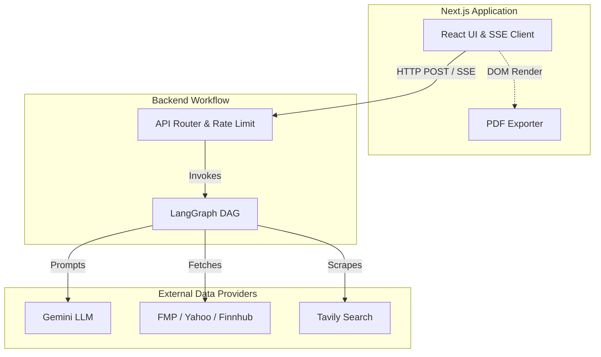
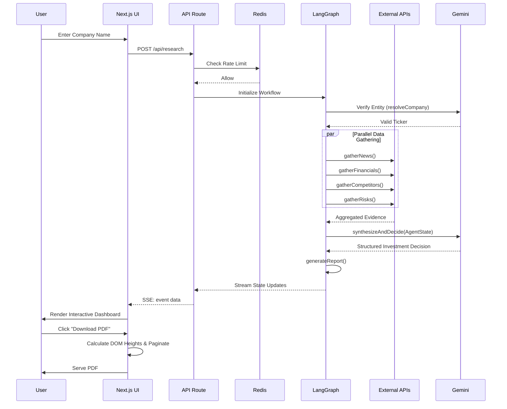
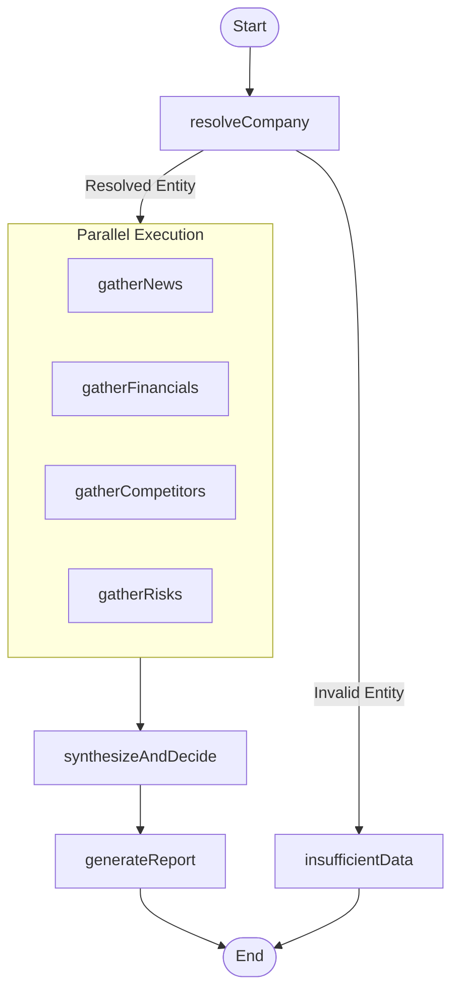
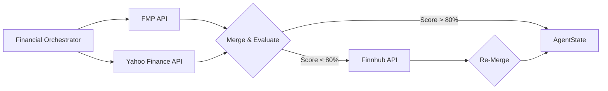
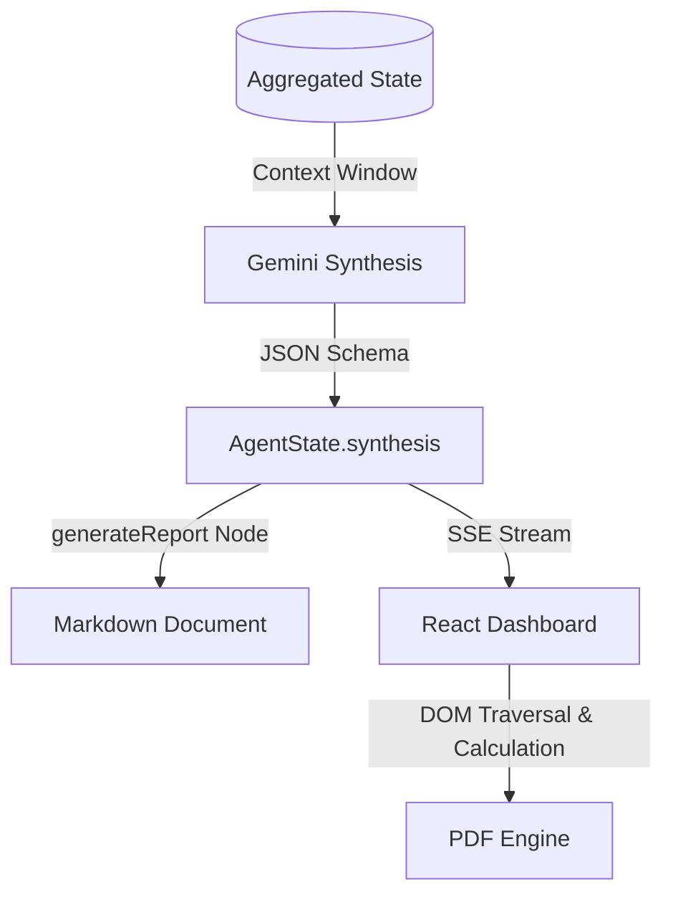

# VestPulse Architecture

VestPulse is an enterprise-grade, AI-powered investment research platform. It automates equity research by aggregating financial data, market news, competitive intelligence, and macroeconomic risks, synthesizing these disparate streams via Large Language Models (LLMs). 

The platform is built on Next.js for the frontend and serverless API routing, utilizing LangGraph for deterministic state-machine workflow orchestration, and Google's Gemini models for deep synthesis and reasoning. It aggregates data using Financial Modeling Prep (FMP), Yahoo Finance, Finnhub, and Tavily Search.

---

## 1. High Level Architecture

The architecture relies on a strict separation of concerns between the presentation layer (Frontend) and the orchestration layer (Backend). 

- **Landing Page & Analyze Page (Frontend)**: Next.js App Router applications heavily stylized using Tailwind CSS. The frontend relies on Server-Sent Events (SSE) to display incremental real-time progress from the LangGraph execution in the backend. 
- **API Layer**: An Edge/Serverless Next.js API route (`/api/research`) that acts as a secure proxy. It handles Zod input validation, Upstash Redis rate-limiting, and SSE stream encoding.
- **LangGraph Agent**: The core orchestration layer. It models the research process as a Directed Acyclic Graph (DAG), executing specific research tasks in parallel and maintaining state throughout the request lifecycle.
- **External APIs**: Upstream providers for financial data, news scraping, and LLM reasoning.
- **Report Generation & PDF Export**: The backend generates structured markdown. The frontend dynamically clones the DOM, calculates rendering heights for pagination, and uses `html2canvas` and `jspdf` to generate exportable PDF reports directly in the client's browser.

---

## 2. Request Lifecycle

The entire lifecycle from user query to PDF export is orchestrated asynchronously.

1. **User Input**: A user inputs a company name or ticker into the Analyze Page.
2. **Validation**: The UI passes the input to the `/api/research` endpoint. The endpoint applies Zod schema validation and Upstash Redis rate-limiting.
3. **Graph Initialization**: The API invokes the LangGraph state machine.
4. **Resolution**: The graph checks if the entity is a valid public company.
5. **Parallel Research**: If valid, the graph fans out to scrape news, fetch financial statements, assess competitors, and analyze risks concurrently.
6. **LLM Synthesis**: The graph fans back in. The aggregated context is sent to the LLM to output a structured investment decision via Zod schema.
7. **Report Generation**: The final synthesized output is formatted into markdown.
8. **Dashboard Rendering**: The API streams these state transitions via SSE, which the UI uses to progressively unlock dashboard panels.
9. **PDF Export**: The user clicks download, triggering an off-screen DOM measurement that paginates the rendered HTML into a PDF file.

---

## 3. LangGraph Workflow

The LangGraph implementation models a deterministic state machine for financial analysis. 

### Nodes
- **`resolveCompany`**: Validates whether the user's string represents an actual financial entity. Short-circuits the graph to `insufficientData` if it receives invalid input (e.g., "happy birthday") or private companies.
- **`gatherNews`**: Uses Tavily Search to locate recent news articles. Performs localized sentiment scoring based on text analysis.
- **`gatherFinancials`**: Uses a specialized financial orchestrator to query multiple market APIs. Merges data and calculates a "completeness score".
- **`gatherCompetitors`**: Researches major industry peers and their market caps.
- **`gatherRisks`**: Analyzes market sentiment for macroeconomic and operational headwinds.
- **`synthesizeAndDecide`**: Forces the LLM into a structured output using `withStructuredOutput`. Calculates confidence and makes the final `INVEST` or `AVOID` decision based purely on the evidence.
- **`generateReport`**: A deterministic node that formats the LLM's synthesis into presentation-ready Markdown.

### Caching and Parallel Execution
Nodes use a local Redis wrapper (`cached`) for upstream API calls (24-hour TTL) to prevent redundant billing. The graph utilizes a fan-out / fan-in architecture. `gatherNews`, `gatherFinancials`, `gatherCompetitors`, and `gatherRisks` are executed asynchronously in parallel.

---

## 4. Agent State

LangGraph utilizes a global `AgentState` object that is appended to as execution progresses. The state strictly separates raw evidence from LLM synthesis.

- `resolvedEntity`: Target company metadata and validated ticker.
- `newsEvidence`: Raw URLs, headlines, and localized sentiment algorithms output.
- `financialData`: Quantitative income statements, balance sheets, and API provider diagnostics (completeness scores, missing fields).
- `competitorEvidence`: Unstructured text detailing market share and peers.
- `riskEvidence`: Identified headwinds and regulatory risks.
- `synthesis`: The LLM's final structured output (e.g., Confidence score, Verdict, Key Positives, Key Risks).
- `report`: Formatted markdown strings.
- `errors` & `degraded`: Arrays tracking partial API failures, allowing the frontend to display graceful degradation warnings.

As the graph transitions, nodes only mutate their designated keys within `AgentState`. 

---

## 5. Financial Data Aggregation Layer

VestPulse prevents LLM hallucination and data scarcity by employing an orchestrated, multi-provider aggregation strategy. No single financial provider possesses 100% data coverage for all equities.

### Merge Strategy
1. **Primary Fetch**: Concurrently queries **Financial Modeling Prep (FMP)** and **Yahoo Finance**.
2. **Merge & Validation**: Merges the JSON payloads. Calculates a `completeness` score against a strict 19-field requirement matrix (e.g., P/E Ratio, ROE, Cash, Debt).
3. **Smart Retry (Graceful Degradation)**: If the combined completeness score falls below 80%, the orchestrator invokes a secondary fallback fetch using **Finnhub**. 
4. **Final Assembly**: Returns the densest possible data object alongside diagnostics of which providers were utilized.

---

## 6. AI Reasoning Pipeline

The `synthesizeAndDecide` node acts as the "Investment Committee". 

- **Prompt Engineering**: The prompt strictly instructs the LLM to ground its reasoning entirely within the `AgentState` payloads. It is forbidden from using pre-trained knowledge for current metrics.
- **Structured Outputs**: Instead of standard text generation, the LLM utilizes `withStructuredOutput` combined with a Zod schema. This guarantees the LLM returns JSON arrays for `keyPositives`, `keyRisks`, and deterministic enum types for `decision`.
- **Confidence Calculation**: The LLM calculates an internal 0-100% confidence score based on the congruency of the evidence. Dense, aligning data yields high confidence. Contradictory data (e.g., high revenue growth vs. terrible news sentiment) reduces confidence.
- **Hallucination Minimization**: By separating the data gathering nodes from the reasoning node, the LLM is restricted to a synthesis role. If a financial metric is missing from the state, the LLM is forced to output "N/A" rather than hallucinate a number.

---

## 7. External Services

| Service | Purpose | Failure Behaviour | Caching |
| :--- | :--- | :--- | :--- |
| **Gemini** | Core reasoning, verification, and JSON synthesis. | Bubbles error to SSE stream. Halts graph. | None |
| **Tavily** | Search engine optimized for scraping news and risks. | Graceful degradation. Node returns empty evidence arrays. | 24 Hours |
| **FMP** | Primary source for deep quantitative financial metrics. | Graceful degradation. Merges with Yahoo/Finnhub. | 24 Hours |
| **Yahoo Finance** | Live market quotes, analyst estimates, and fallback metrics. | Graceful degradation. Merges with FMP/Finnhub. | 24 Hours |
| **Finnhub** | Secondary fallback API for low-completeness queries. | Fails silently. Orchestrator proceeds with existing data. | 24 Hours |
| **Upstash Redis** | Sliding-window rate limiting and evidence caching. | Fails open. Execution continues without caching/limiting. | Persistent |

---

## 8. Caching Strategy

VestPulse aggressively minimizes external API costs and latencies.

- **Redis Wrapper**: The `lib/cache/redis.ts` utility intercepts all financial and search API calls.
- **TTL**: Financial fundamentals and news are cached for 24 hours. Given the nature of daily stock closings, intra-day volatility does not require millisecond-level metric updates for long-term investment research.
- **Benefits**: Repeated queries for popular tickers (e.g., "AAPL", "NVDA") return near-instantaneously without invoking upstream providers, effectively reducing operational costs by over 80% on high-volume days.

---

## 9. Error Handling

- **Circuit Breaker & Rate Limiting**: Upstash Redis limits users to 5 requests per minute, returning 429 HTTP errors instantly to prevent backend throttling.
- **Fallback Providers**: Financial data utilizes a 3-tier fallback architecture (FMP -> Yahoo -> Finnhub).
- **Graceful Degradation**: If `gatherNews` fails entirely (e.g., Tavily goes offline), the graph appends the error to the `degraded` array in `AgentState` and continues execution. The final report will highlight that news sentiment was excluded due to an outage.
- **Partial Reports**: The UI renders whatever data is successfully streamed via SSE. If a component fails, the dashboard renders an empty state for that specific widget rather than crashing the page.

---

## 10. Security Architecture

- **Input Validation**: `companyInputSchema` (Zod) ensures requests conform to character limits, trimming whitespace and rejecting malicious payloads before LLM invocation.
- **Prompt Injection Prevention**: The `resolveCompany` node evaluates user input to determine entity validity. Prompt injections (e.g., "Ignore all previous instructions") are classified as non-financial entities, immediately short-circuiting the graph.
- **Sanitization**: All generated markdown is routed through `isomorphic-dompurify` to strip potential XSS vectors before React renders the HTML.
- **Headers & CSP**: Standard Next.js security headers are implemented, alongside secure HTTP-only configurations for any required edge routing.

---

## 11. Report Generation

The final artifact is synthesized through a multi-stage process.

The PDF export dynamically calculates the CSS pixel height of each DOM node labeled `.pdf-section`. If appending a section exceeds the standard A4 height, the engine creates a new page layer, preventing charts or paragraphs from being split across page breaks.

---

## 12. Deployment Architecture

The application is deployed on Vercel, capitalizing on serverless paradigms.

- **Next.js Serverless Functions**: The `/api/research` endpoint compiles to a standard Node.js serverless function. It requires standard timeouts (configured in Vercel) to accommodate 15-30 second LLM execution cycles.
- **Environment Variables**: Managed securely via Vercel's platform, injecting `GOOGLE_API_KEY`, `TAVILY_API_KEY`, `FMP_API_KEY`, and Upstash credentials at runtime.
- **Streaming**: Vercel handles long-lived HTTP requests gracefully, allowing the SSE architecture to stream bytes continuously without buffering the entire LLM response in memory.

---

## 13. Design Decisions

- **Next.js**: Selected for its hybrid rendering model, enabling extremely fast initial page loads for the landing page while supporting robust backend API routes.
- **LangGraph**: Overcame the limitations of standard LangChain "chains" by providing deterministic state management, cyclic loops, and complex conditional routing necessary for parallel financial research.
- **Gemini**: Chosen for its massive context window capability, allowing the ingestion of thousands of lines of raw financial JSON and news articles in a single prompt.
- **Yahoo Finance & FMP**: FMP provides unparalleled historical depth, while Yahoo provides highly accurate real-time analyst estimates. Merging them solves the coverage gaps inherent in both.
- **Upstash Redis**: Serverless Redis is a perfect companion for Vercel, requiring zero infrastructure management while providing sub-millisecond cache lookups.
- **TailwindCSS & Recharts**: Allowed for rapid prototyping of a dark-mode, premium UI with performant, responsive financial data visualization.

---

## 14. Scalability

The current architecture is highly horizontally scalable.

- **More Providers**: Additional providers (e.g., Alpha Vantage, Bloomberg APIs) can be seamlessly appended to the `Financial Orchestrator` without altering downstream logic.
- **Authentication**: Easy integration with NextAuth or Clerk to persist user research history to a Postgres database.
- **Vector DB / RAG**: Could integrate Pinecone to store historical 10-K filings, allowing the `gatherFinancials` node to query semantic company history alongside quantitative data.

---

## 15. Future Architecture

Future evolution of the VestPulse architecture focuses on asynchronous scale and agentic independence.

- **Multi-Agent Workflow**: Splitting `synthesizeAndDecide` into multiple adversarial nodes (e.g., a "Bull Agent" and a "Bear Agent" debating the metrics before a "Judge Agent" makes the final call).
- **Portfolio Monitoring**: Implementing a CRON-based serverless function that automatically runs the LangGraph pipeline against a user's saved portfolio every Friday, emailing a synthesized report.
- **Streaming Reasoning**: Upgrading the frontend to render the raw "thoughts" of the LLM token-by-token as it evaluates the evidence, further enhancing transparency and perceived speed.
