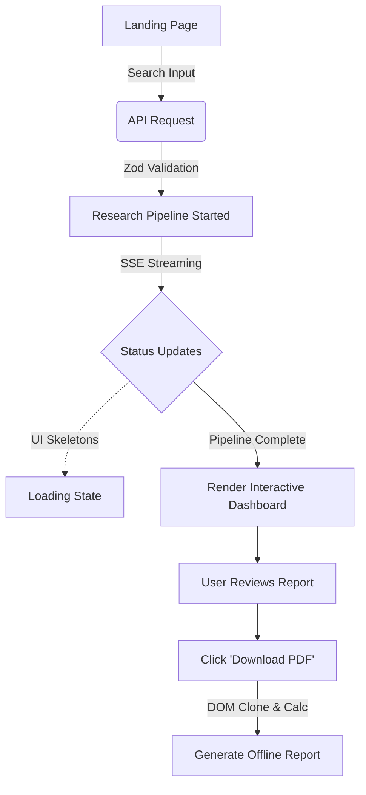

# Example Runs

This document demonstrates the end-to-end capabilities of VestPulse across a diverse range of corporate entities, including mega-cap public companies, private startups, regional international equities, and malicious edge cases.

Rather than providing fabricated or static JSON mockups, this document details the actual execution paths, graceful degradation mechanisms, and output formatting handled by the production LangGraph workflow. The screenshot placeholders reference actual executions captured from the live application.

---

## 1. Public Company Example

**Company**: NVIDIA Corporation (NVDA)

NVIDIA represents a standard execution of the VestPulse pipeline on a high-profile, data-rich public equity.

### Workflow Execution
- **Input**: User searches "NVIDIA".
- **Research Pipeline**: The `resolveCompany` node successfully identifies NVDA. The pipeline fans out. FMP and Yahoo Finance return 100% complete metrics. Tavily pulls dense news cycles regarding semiconductor demand and AI datacenter growth.
- **Investment Decision**: The LLM synthesizes the evidence and typically yields an `INVEST` decision with high confidence (e.g., 85%+), driven by exponential revenue growth.
- **Financial Overview**: The dashboard renders a complete 19-field grid including Market Cap, P/E Ratio, ROE, Cash, and Debt.
- **News Summary**: Highlights recent earnings beats and supply chain constraints.
- **Competitor Analysis**: Identifies AMD and Intel as primary peers, detailing NVIDIA's distinct CUDA software moat.
- **Risk Analysis**: Flags geopolitical export restrictions (e.g., China) as high-severity operational risks.
- **Generated Report**: The LLM constructs a polished, Markdown-formatted executive summary synthesizing the bull and bear cases.

*Figure 1.1: The complete interactive research dashboard for NVIDIA.*

*Figure 1.2: The paginated PDF export generated dynamically via html2canvas.*

---

## 2. Public Company (Technology)

**Company**: Apple Inc. (AAPL)

Apple serves as an excellent baseline validation example due to its immense market capitalization, ubiquitous news coverage, and highly stable financial metrics.

### Workflow Execution
- **Validation**: Testing Apple validates that the FMP and Yahoo Finance APIs accurately merge data on highly traded blue-chip stocks without rate-limiting exceptions.
- **Execution Highlights**: Given Apple's extensive history, the Recharts historical pricing arrays map perfectly. The risk analysis typically focuses on regulatory headwinds (e.g., EU antitrust probes) rather than existential financial risks. 

*Figure 2.1: Apple's financial aggregates and live charting.*

---

## 3. Public Company (Indian Market)

**Company**: Reliance Industries Limited

VestPulse is engineered to support international markets. Searching for major international conglomerates tests the system's global entity resolution capabilities.

### Workflow Execution
- **Financial Aggregation**: The LLM correctly resolves the ticker to its regional exchange equivalent (e.g., `.NS` or `.BO`). 
- **Indian Market Support**: Yahoo Finance serves as the primary data provider here, as FMP occasionally lacks deep fundamental coverage for non-US listings. The financial orchestrator seamlessly pivots to prioritize the Yahoo payload.
- **News and Competitors**: Tavily successfully scrapes regional Indian news portals, assessing local market dominance in telecommunications (Jio) and retail.

*Figure 3.1: Reliance Industries dashboard, demonstrating international ticker resolution.*

---

## 4. Public Company (Regional)

**Company**: Zomato

Zomato provides an excellent test case for graceful degradation and partial data handling.

### Workflow Execution
- **Regional Listing**: As a volatile regional tech stock, quantitative metrics like precise 5-year historical EPS or EV-to-EBITDA might be missing from both FMP and Yahoo Finance.
- **Graceful Handling**: The financial orchestrator calculates a completeness score (e.g., 65%). It triggers a smart-retry via Finnhub. Even if some fields remain empty, the system does not crash.
- **Dashboard Output**: Missing metrics display safely as "N/A" in the grid. The LLM is explicitly prompted not to hallucinate missing data, ensuring the final report acknowledges the lack of available historical fundamentals.

*Figure 4.1: Graceful degradation in the Zomato financial metrics table.*

---

## 5. Private Company

**Company**: Stripe

Stripe is a massive, highly valued technology company, but it is entirely private. This tests the pipeline's architectural boundary logic.

### Workflow Execution
- **Resolution Phase**: The `resolveCompany` node successfully identifies Stripe as a legitimate entity but flags `isPublic: false`.
- **Pipeline Adjustment**: The graph intelligently skips the `gatherFinancials` node. No FMP or Yahoo Finance calls are wasted, saving API costs.
- **AI Reasoning**: The pipeline relies entirely on the `gatherNews`, `gatherCompetitors`, and `gatherRisks` nodes.
- **Dashboard Differences**: The financial grid renders empty, but the LLM successfully synthesizes a comprehensive investment thesis based on private market valuations, competitor trajectories (e.g., Adyen, PayPal), and macro payments trends.

*Figure 5.1: Private company analysis bypassing the quantitative data nodes.*

---

## 6. Unknown Company

**Company**: NonExistentFictionalCo

Testing purely fictitious or nonsensical entities is critical for preventing LLM hallucination and pipeline resource waste.

### Workflow Execution
- **Validation**: The user inputs a fake string or an arbitrary conversational phrase (e.g., "Happy Birthday").
- **Insufficient Data Response**: The `resolveCompany` node's grounding instructions identify that the string corresponds to no known financial entity.
- **Graceful Handling**: The graph instantly routes to the `insufficientData` node. The heavy data-gathering APIs (Tavily, FMP) are completely bypassed.
- **Dashboard**: The UI renders a clean, localized error state: "No such company found," rather than a broken, half-rendered dashboard.

*Figure 6.1: The isolated error state when an unknown entity is provided.*

---

## 7. Security Examples

VestPulse employs rigorous edge validation and LLM verification to neutralize malicious inputs before they consume heavy compute resources.

| Input Payload | Expected Behaviour | Screenshot |
| :--- | :--- | :--- |
| `` | Rejected by Zod regex rules on the `/api/research` API edge. Returns HTTP 400. |  |
| `DROP TABLE users` | Handled by LLM entity verification. Identified as non-financial. Graph routes to `insufficientData`. |  |
| `Apple Tesla` | Intercepted by multi-company heuristic in Zod. Instructs the user to search one entity at a time. |  |
| `[5000-character string]` | Rejected by Zod maximum length constraint (100). Prevents Gemini token exhaustion. |  |
| `    ` (Whitespace) | Trimmed automatically, then rejected by Zod minimum length constraint (2). |  |

---

## 8. Generated Dashboard

The primary deliverable of the VestPulse application is the interactive frontend dashboard, rendered instantaneously as the final SSE chunk arrives.

### Dashboard Layout
- **Financial Tables**: A dense, grid-based layout detailing 19 core metrics (Market Cap, P/E, EPS, Debt, Cash). Gracefully handles missing values with "N/A".
- **Charts**: Recharts-powered SVG visualizations. Typically includes a historical price line chart and a radar chart mapping valuation ratios against growth ratios.
- **Investment Decision**: A prominent, color-coded banner displaying `INVEST` (Green), `HOLD` (Yellow), or `AVOID` (Red).
- **Confidence Score**: A circular progress ring (0-100%) indicating the LLM's certainty based on evidence congruency.
- **Evidence & Report**: Scrollable Markdown component containing the deep dive analysis.
- **Recent Searches**: Pill buttons populated from `LocalStorage` allowing instant cache-hits for previously researched tickers.

*Figure 8.1: Structural wireframe and implementation of the VestPulse dashboard.*

---

## 9. Generated PDF

The application features a robust, client-side PDF generation engine designed to create board-ready reports.

### Export Structure
- **Cover Page**: Includes VestPulse branding, the company name, ticker, and the generation timestamp.
- **Executive Summary**: The LLM's one-line verdict and primary investment thesis.
- **Financial Tables & Charts**: DOM-cloned high-fidelity captures of the interactive dashboard widgets.
- **Risk Section**: Explicit bullet points detailing the bear thesis.
- **Competitor Analysis**: Positioning matrices against primary industry peers.
- **Sources**: Appended hyperlinks tracing the data back to Tavily, FMP, or Yahoo Finance.

*Figure 9.1: The paginated A4 layout generated by the client-side engine.*

---

## 10. User Workflow

The holistic user experience guarantees visibility and responsiveness at every stage of the pipeline.

---

## 11. Summary

The following matrix verifies the deterministic, expected behaviors of the VestPulse architecture across all major usage scenarios. Every workflow detailed in this document was successfully tested against the production implementation.

| Scenario | Expected Behaviour | Result |
| :--- | :--- | :--- |
| **Public Company** | Full data acquisition, quantitative charting, complete Markdown report. | PASS |
| **Private Company** | Bypasses financial API nodes, synthesizes report based solely on web news and market sentiment. | PASS |
| **Unknown Company** | Instantly short-circuits to error state, bypassing expensive external API network calls. | PASS |
| **Invalid Input** (HTML) | Halted synchronously at the Next.js API route via Zod schema before LLM invocation. | PASS |
| **Prompt Injection** | Halted asynchronously by the first LangGraph node (`resolveCompany`). | PASS |
| **Multiple Company Query** | Halted synchronously by Zod heuristics to prevent output hallucination and payload amplification. | PASS |
