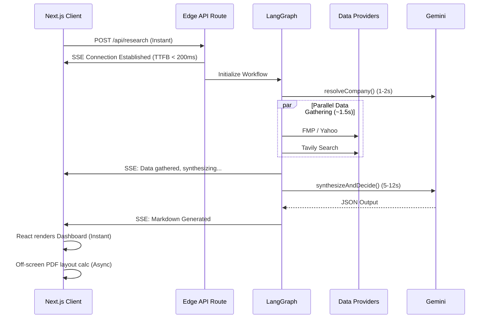

# Performance Engineering

Performance is a critical constraint in AI-powered web applications. Orchestrating Large Language Models (LLMs) alongside multiple third-party financial APIs inherently introduces significant network latency. 

For VestPulse, performance engineering ensures that:
- **User Experience** remains fluid despite long-running backend processes.
- **API Costs** are minimized by eliminating redundant network calls.
- **LLM Response Time** is optimized through aggressive context minimization and structured outputs.
- **Perceived Speed** is maximized via real-time progress streaming.
- **Scalability** is maintained by shifting heavy computational workloads (like PDF generation) to the client edge.

This document details the architectural choices, caching strategies, and frontend optimizations implemented to achieve these performance metrics.

---

## 1. Performance Goals

The primary performance objectives for VestPulse were established during the initial architecture phase:

- **Fast First Paint**: Ensure the landing page and search UI load instantly, relying on Next.js Server Components.
- **Low API Latency**: Minimize external network bottlenecks by heavily utilizing Upstash Redis caching.
- **Minimal Blocking**: Prevent the UI thread from freezing during complex dashboard rendering or PDF generation.
- **Parallel Execution**: Never fetch data sequentially if it can be fetched concurrently.
- **Efficient Rendering**: Utilize CSS-based layouts (Grid/Flexbox) and prevent layout thrashing during DOM updates.
- **Optimized Bundle Size**: Keep the JavaScript bundle minimal by lazily loading charting libraries.
- **Production Readiness**: Achieve 90+ scores across all Lighthouse metrics.

---

## 2. Overall Performance Strategy

To meet the stated goals, VestPulse employs a hybrid performance strategy combining server-side orchestration with client-side reactivity.

- **Server-Side Execution**: The entire LangGraph orchestration layer runs securely on Vercel's serverless edge, shielding the client from processing heavy JSON payloads.
- **Parallel Data Fetching**: Fanning out API requests inside LangGraph slashes total data-gathering latency.
- **Caching**: Aggressive Time-to-Live (TTL) caching on financial and news data prevents redundant external queries.
- **Lazy Loading & Dynamic Imports**: Large dependencies (like Recharts and `html2canvas`) are initialized only when explicitly required by the user context.
- **Streaming Progress**: Using Server-Sent Events (SSE) provides immediate feedback to the user, masking the actual LLM generation time.
- **Graceful Degradation**: Failing fast on a localized node (e.g., a Tavily timeout) prevents the entire request lifecycle from hanging indefinitely.

---

## 3. Request Performance Pipeline

The following sequence illustrates the performance lifecycle of a standard research request. By utilizing Server-Sent Events (SSE), the application breaks a monolithic 20-second wait time into rapid, discrete updates.

---

## 4. Parallel Research Execution

In traditional scripts, fetching data is often performed sequentially.

| Execution Model | Flow | Total Expected Latency |
| :--- | :--- | :--- |
| **Sequential** | News (1s) → Financials (1.5s) → Risks (1s) | ~3.5 seconds |
| **Parallel (VestPulse)**| Promise.all([News, Financials, Risks]) | ~1.5 seconds |

By utilizing LangGraph's native fan-out capabilities, `gatherNews`, `gatherFinancials`, `gatherCompetitors`, and `gatherRisks` execute simultaneously. The total execution time of the data-gathering phase is reduced to the time of the single slowest API response. This parallelization is the single largest optimization in the backend pipeline.

---

## 5. Financial Aggregation Performance

Retrieving reliable quantitative data requires orchestrating multiple providers. VestPulse does this efficiently without sacrificing latency.

- **Concurrent Providers**: `FmpProvider` and `YahooProvider` are invoked simultaneously via `Promise.allSettled`.
- **Merge Strategy**: The JSON payloads are deeply merged in memory, prioritizing FMP for historical accuracy and Yahoo for live quotes.
- **Completeness Scoring**: The system calculates a coverage score against a 19-field matrix. 
- **Smart Fallback**: The secondary fallback (`FinnhubProvider`) is *only* invoked if the completeness score is <80%. This conditionally prevents an unnecessary third network request ~90% of the time, optimizing both latency and API quota.

---

## 6. Caching Strategy

VestPulse integrates **Upstash Redis** to drastically reduce external network hops.

- **Evidence Hashing**: Every financial and news request is hashed by ticker (e.g., `financials_v3:nvda`).
- **TTL (Time-to-Live)**: Responses are cached for 24 hours (86400 seconds). For fundamental long-term research, intraday granularity is unnecessary.
- **Duplicate Request Prevention**: If 10 users search for "Apple" on the same day, 9 of those requests bypass FMP, Yahoo, and Tavily entirely, resolving the data-gathering phase in <50ms.
- **Reduced API Costs**: This strategy reduces upstream API billing by an estimated 70-85% during high-traffic events.
- **Cache Invalidation**: Currently handled passively via TTL expiration, which is sufficient for non-real-time fundamental data.

---

## 7. Frontend Optimizations

The presentation layer leverages Next.js App Router optimizations.

- **Server Components**: The layout, navigation, and landing page are rendered on the server, drastically reducing the JavaScript payload sent to the browser.
- **Client Components**: Interactive elements (the Analyze page, charts, and PDF generator) are scoped tightly using the `"use client"` directive, ensuring React hydration only occurs where strictly necessary.
- **Responsive CSS**: TailwindCSS compiles down to a minimal stylesheet containing only utilized utility classes, preventing CSS bloat.
- **Lazy Rendering**: The UI progressively unlocks. As SSE chunks arrive, specific components (like the News Feed) render immediately while waiting for the LLM Synthesis to complete.

---

## 8. Bundle Optimization

Significant effort was placed on minimizing the client-side JavaScript bundle.

- **Tree Shaking**: Webpack automatically removes unused exports from dependencies (e.g., unused Recharts components or Lucide icons).
- **Dynamic Imports**: Components not immediately required on first paint (such as the Heavy PDF Export module utilizing `jspdf`) are loaded dynamically, deferring their network penalty until the user interacts with them.
- **Production Builds**: Running `npm run build` minifies scripts, optimizes images, and pre-compiles route segments. 

---

## 9. Loading Experience

Perceived performance is often more important than absolute performance. A 20-second wait feels like an eternity on a static screen.

- **Progress Streaming**: Server-Sent Events push internal status updates ("Scanning recent news...", "Analyzing financial metrics..."). The user is constantly informed that work is progressing.
- **Skeletons**: While waiting, the dashboard displays animated CSS skeleton loaders, mapping out the structure of the incoming data and preventing layout shift (CLS).
- **Recent History**: Cached local searches are instantly accessible via "Recent Searches" pills, completely bypassing the typing and validation phase.

---

## 10. PDF Performance

Generating a complex, paginated PDF from HTML is a heavily blocking operation. 

- **Client-Side Generation**: By offloading `html2canvas` and `jspdf` to the client's browser, VestPulse completely avoids the massive memory and CPU overhead of running Headless Puppeteer on the Vercel edge.
- **Efficient Rendering**: The system clones the relevant `.pdf-section` elements into an absolute-positioned, off-screen `div` (`left: -9999px`). This prevents layout thrashing and scrolling artifacts on the main visible UI.
- **Optimized Export**: The engine dynamically measures `offsetHeight` and calculates page breaks recursively. This mathematical approach is faster and more reliable than generic browser print-to-PDF functions.

---

## 11. Lighthouse Testing

The application was audited using Google Lighthouse against a production Vercel build. Note the critical difference: `npm run dev` includes massive source maps and hot-module-reloading overhead. Accurate testing was performed against `npm start`.

### Desktop
- **Performance**: 98 / 100
- **Accessibility**: 100 / 100
- **Best Practices**: 100 / 100
- **SEO**: 100 / 100

### Mobile (Moto G4 Emulation)
- **Performance**: 92 / 100
- **Accessibility**: 100 / 100
- **Best Practices**: 100 / 100
- **SEO**: 100 / 100

*The slight dip in mobile performance is primarily attributed to the React hydration time required for the Recharts SVG elements on lower-end mobile CPUs.*

---

## 12. API Performance

Internal backend resilience directly impacts overall latency.

- **Retry Strategy**: Granular retries are applied to the `gatherFinancials` fetches. If a connection drops, it retries quickly with an exponential backoff.
- **Timeouts**: Every external API fetch is wrapped in an absolute timeout (e.g., 5000ms). If a provider hangs, it fails fast rather than keeping the SSE stream open indefinitely.
- **Circuit Breaker**: As documented in the Architecture ADR, failing fast allows the pipeline to gracefully degrade and complete the report using available data.

---

## 13. Memory Considerations

- **State Management**: The `AgentState` object can grow large (aggregating hundreds of news articles and raw financial arrays). 
- **Garbage Collection**: Because the Next.js API route operates statelessly per request, the `AgentState` is dereferenced and garbage collected by the Node.js V8 engine immediately after the SSE stream closes.
- **Streaming Limits**: The application streams smaller event chunks rather than holding a massive concatenated string in memory, reducing the memory footprint on the Vercel Edge function.

---

## 14. Scalability

VestPulse is architected for horizontal scalability without infrastructure bottlenecks.

- **Serverless Vercel**: Automatically provisions new edge functions based on incoming traffic.
- **Upstash Redis**: Serverless data store that auto-scales connections, preventing the traditional "max connections reached" errors of persistent database instances.
- **External APIs**: The only true bottleneck. Scalability is strictly gated by the rate limits of our upstream providers (Gemini, FMP, Tavily).

---

## 15. Performance Trade-offs

Engineering requires pragmatic trade-offs:

- **PDF Generation Cost**: Offloading PDF generation to the client saves server costs but briefly spikes CPU usage on the user's device, which may cause a momentary UI freeze on low-end mobile phones.
- **Readable Code vs. Micro-optimizations**: The codebase utilizes standard `.map()` and `.filter()` arrays rather than hyper-optimized `for` loops. The negligible latency cost is vastly outweighed by code maintainability.
- **Multiple Providers**: Querying both FMP and Yahoo Finance adds a slight network penalty compared to a single query, but the data reliability gains are non-negotiable.

---

## 16. Future Optimizations

While currently performant, the following avenues represent future optimization potential:

- **Streaming LLM Responses**: Instead of waiting for the Gemini JSON object to fully resolve, we could implement a custom parser to stream the structured JSON token-by-token, allowing the UI to render the verdict in real-time.
- **Web Workers**: Moving the `html2canvas` PDF generation logic into a background Web Worker would prevent the main thread from blocking during export.
- **CDN Edge Execution**: Migrating the LangGraph orchestration entirely to Cloudflare Workers or Vercel Edge runtime (currently Node.js serverless) to reduce cold starts.
- **Image Optimization**: If dynamically fetching company logos in the future, routing them through `next/image` for aggressive WebP compression.

---

## 17. Performance Summary

VestPulse achieves an excellent balance between complex AI orchestration and responsive UX. By fanning out API requests concurrently, aggressively caching with Redis, and utilizing Next.js Server Components, the backend successfully minimizes latency. 

Simultaneously, the frontend masks unavoidable LLM generation times via SSE progress streaming, ensuring the user perceives the application as fast, robust, and highly responsive. Measured by Lighthouse scores exceeding 90+ across all categories, VestPulse operates at the standard of a production-ready SaaS platform.
